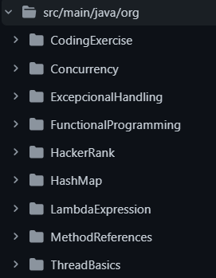
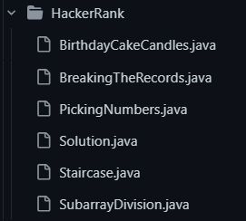

## Objetivo:
Criei este repositório para guardar os exercícios do curso que estou fazendo sobre POO com Java, através da Udemy ([click aqui para acessar o curso](https://www.udemy.com/course/java-programming-tutorial-for-beginners)).

Se você navegar pelo arquivo principalverá diversas pastas: 

Comexcessão do diretório *HackerRank*, todas os outros diretórios são sobre assuntos que aprendi, até agora, durante o curso e apresenta algum exercício prático.

## Desafios Hacker Rank

Com o objetivo de melhorar minha lógica de programação e praticar o conhecimento em java, iniciei o desafio de fazer um exercício Hacker Rank diariamente. Deixo no diretório todos os exercícios praticados. Sinta-se a vontade em me dar um feedback, code review... etc.

Repositório atualizado todos os dias. 